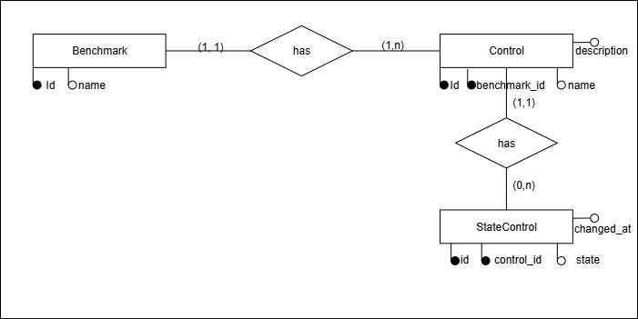

# Desafio Back-End — Questão 1

## Modelo Conceitual (MER)

O modelo foi desenhado para representar Benchmarks, seus Controles e o histórico de mudanças de estado de cada controle.

### Entidades

- **Benchmark**
  - `id` (PK, INDEX)
  - `name` (INDEX opcional)

- **Controle**
  - `id` (PK, INDEX)
  - `benchmark_id` (FK → benchmark_id, INDEX)
  - `name`
  - `description`

- **EstadoControle**
  - `id` (PK, INDEX)
  - `control_id` (FK → control_id, INDEX)
  - `state` (`ok | alarm`)
  - `changed_at` (timestamp, INDEX junto com `control_id`)

### Relacionamentos

- **Benchmark (1) — (N) Control**
- **Control (1) — (N) StateControl**

---

- **Benchmark possui varios controles**
- **Control percence a um benchmark**
- **Control possui varios estado (histórico de alterações)**

---

## Cenários Atendidos

1. **Listar Benchmark com seus Controles e estado atual**
   - Buscar o último registro (`MAX(changed_at)`) de cada `Control`.

2. **Listar Benchmark com seus Controles e mudanças de estado em intervalo**
   - Filtrar `StateControl.changed_at BETWEEN data_inicial AND data_final`.

3. **Obter Benchmark com seus Controles e estado em data/hora X**
   - Selecionar o registro mais recente (`changed_at <= X`) para cada controle.

---

## Índices Utilizados

- **PKs em todas as tabelas**
  - Garantem unicidade e performance em joins.

- **FKs indexadas**
  - `Control.benchmark_id`
  - `StateControl.control_id`

- **Índice composto em `StateControl (control_id, changed_at)`**
  - Acelera consultas por:
    - último estado de um controle (Q1)
    - mudanças em intervalo (Q2)
    - estado em uma data/hora X (Q3)

- **Índice em nomes (`Benchmark.name`, `Control.name`) [opcional]**
  - Útil para buscas textuais.

---

## Diagrama MER

