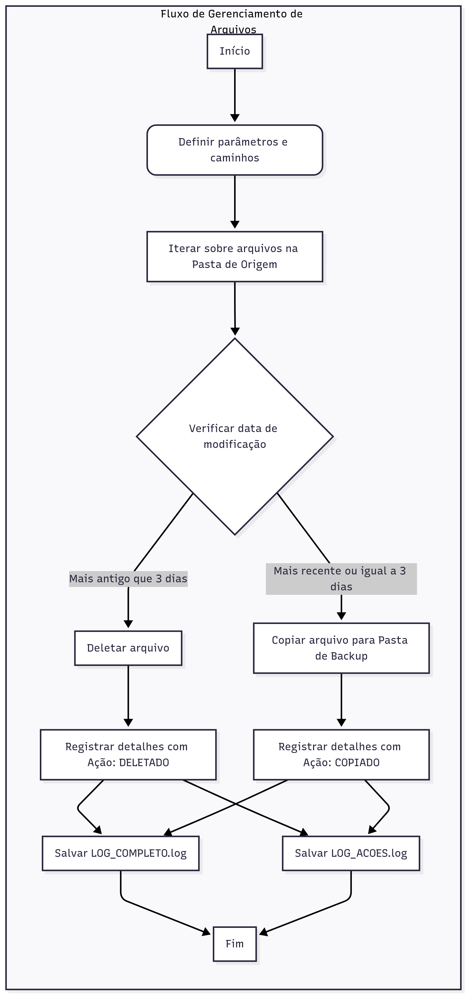

# Desafio Back-End — Questão 2

### **Tecnologias Usadas**

O script de gerenciamento de arquivos foi feito em **Python**, usando apenas suas bibliotecas padrão, ou seja, não precisa instalar nada a mais.

---

### **Módulos Principais**

* **`os` e `shutil`:** Usados para interagir com o sistema, como deletar (`os.remove`) e copiar arquivos (`shutil.copy2`).
* **`datetime`:** Essencial para lidar com datas, como calcular a idade dos arquivos.
* **`pathlib`:** Fornece um jeito mais moderno e seguro de manipular caminhos de arquivos e pastas.
* **`csv`:** Usado para criar os arquivos de log no formato CSV, o que os torna fáceis de ler no Excel ou em editores de texto.

---

### **Formato de Dados**

Os logs são salvos em formato **CSV**, com a extensão `.log`. Essa escolha mantém as informações organizadas em colunas, facilitando a análise.
---

## Funções Principais

### `salvar_log_csv(caminho_log, cabecalho, dados)`

* **Objetivo:** Salvar dados em um arquivo CSV, mantendo a extensão `.log`.
* **Parâmetros:**

  * `caminho_log`: caminho do arquivo de log.
  * `cabecalho`: lista com os nomes das colunas.
  * `dados`: lista de listas contendo as informações a serem registradas.
* **Descrição:**
  Cria/abre o arquivo, escreve o cabeçalho e todas as linhas de dados. Em caso de erro, exibe mensagem no console.

```python
with open(caminho_log, 'w', newline='', encoding='utf-8') as log_file:
    escritor_csv = csv.writer(log_file, delimiter=';')
    escritor_csv.writerow(cabecalho)
    escritor_csv.writerows(dados)
```

---

### `obter_detalhes_arquivo(caminho_item, acao_tomada="")`

* **Objetivo:** Extrair detalhes de um arquivo ou diretório.
* **Retorna:** `[Nome, Tipo, Tamanho (MB), Data de Modificacao, Acao]`.
* **Descrição:**
  Captura tamanho, extensão ou indica "Diretorio", data da última modificação e a ação tomada (opcional).

```python
tipo = "Diretorio" if caminho_item.is_dir() else caminho_item.suffix
tamanho_mb = round(caminho_item.stat().st_size / (1024*1024), 2)
data_modificacao = datetime.datetime.fromtimestamp(caminho_item.stat().st_mtime)
```

---

### `gerenciar_arquivos(caminho_origem, caminho_backup, dias_para_backup)`

* **Objetivo:** Processar arquivos de uma pasta de origem:

  * **Deleta** arquivos com mais de `dias_para_backup`.
  * **Copia** arquivos mais recentes para a pasta de backup.
* **Parâmetros:**

  * `caminho_origem`: pasta de origem.
  * `caminho_backup`: pasta de backup.
  * `dias_para_backup`: limite em dias para backup.
* **Retorna:**

  * `detalhes_completos` → informações completas de cada arquivo.
  * `detalhes_acoes` → resumo com nome, ação e data.

```python
if data_modificacao < data_corte:
    os.remove(item)
    acao = "DELETADO"
else:
    shutil.copy2(item, caminho_backup / item.name)
    acao = "COPIADO"
detalhes_item[-1] = acao
```

---

### `main()`

* **Objetivo:** Coordenar todo o processo de gerenciamento de arquivos e salvar logs.
* **Descrição:**

  1. Define pastas de origem e backup, dias para backup e caminhos dos logs.
  2. Chama `gerenciar_arquivos` para processar os arquivos.
  3. Salva logs completos e resumidos.

```python
detalhes_completos, detalhes_acoes = gerenciar_arquivos(PASTA_ORIGEM, PASTA_BACKUP, DIAS_BACKUP)
salvar_log_csv(LOG_COMPLETO, CABECALHO_COMPLETO, detalhes_completos)
salvar_log_csv(LOG_ACOES, CABECALHO_ACOES, detalhes_acoes)
```

---

## Logs Gerados

* **LOG\_COMPLETO** → Contém todas as informações detalhadas de cada arquivo:

  * Nome, tipo, tamanho (MB), data de modificação, ação.
* **LOG\_ACOES** → Resumido apenas com:

  * Nome do arquivo, ação (DELETADO/COPIADO), data de modificação.
* **Formato CSV** → Facilita leitura em Excel ou editores de texto, mantendo extensão `.log`.

---

## Boas Práticas Aplicadas

* Modularização: cada função possui **uma única responsabilidade**.
* Registro completo de ações para **rastreabilidade**.
* Tratamento de erros para garantir **robustez**.
* Uso de `Pathlib` e `shutil` para manipulação segura de arquivos.

---

## Fluxograma

