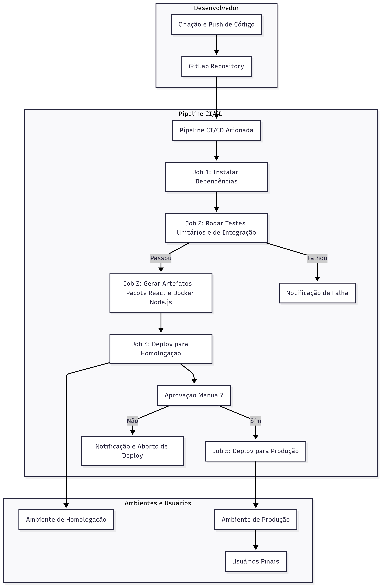

# Desafio Back-End — Questão 3

>Nunca utilizei essa tecnologia e cheguei nessa resposta em uma conversa com um amigo que usa no trabalho dele.

## Otimização do Processo de Deploy para Software Node.js + React

### Problema

Atualmente, a empresa depende do cliente para:

- Empacotar os componentes do front-end (React) e back-end (Node.js);
- Realizar o deploy manualmente em homologação;
- Após uma semana, repetir todo o processo para produção.

Isso gera:

- Retrabalho repetitivo;
- Risco de erros humanos;
- Demora nas entregas.

## Causa

O processo é totalmente manual e sem automação.  
Não há integração contínua nem pipelines automatizados, fazendo com que cada versão dependa de passos repetitivos e sujeitos a falhas humanas.

## Solução (lógica)

A lógica é automatizar o processo utilizando **Integração Contínua (CI) e Entrega Contínua (CD)**. Mesmo sem experiência prática com GitLab, a ideia geral é:

1. **Organização do Repositório**
   - Todo código do front e back deve estar versionado no GitLab.
   - Cada commit dispara pipelines automáticos.

2. **Pipeline de CI (Continuous Integration)**
   - Executar build e testes automaticamente:
     - React: `npm install` + `npm run build` para gerar o bundle;
     - Node.js: instalar dependências e rodar testes unitários.
   - Geração de artefatos prontos para deploy.

3. **Pipeline de CD (Continuous Deployment/Delivery)**
   - Deploy automatizado para homologação.
   - Após aprovação em homologação, deploy automatizado para produção.
   - Possibilidade de regras de aprovação para produção.

4. **Benefícios**
   - Reduz retrabalho manual;
   - Minimiza risco de erros humanos;
   - Torna o processo previsível e auditável;
   - Permite liberar versões mais rapidamente e com segurança.

## Resumo da Lógica

|Etapa|Problema|Solução|
|----------------|------------------|---------------------------------------|
| Deploy manual  | Demorado e propenso a erros | Automatizar build e deploy via CI/CD |
| Repetição semanal | Retrabalho | Pipeline para homologação e produção |
| Empacotamento | Dependência do cliente | Build automático gerando artefatos prontos |

## Fluxograma

